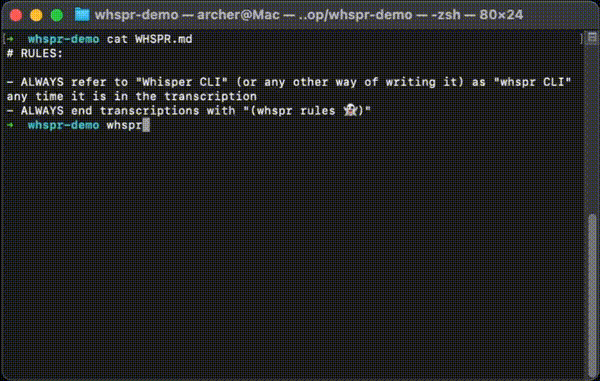

# whspr

[](https://www.npmjs.com/package/whspr)
[](https://choosealicense.com/licenses/mit/)
[](http://makeapullrequest.com)

A CLI tool that records audio from your microphone, transcribes it using Groq's Whisper API, and post-processes the transcription with AI to fix errors and apply custom vocabulary.

<p align="center">
  
</p>

## Installation

```bash
npm install -g whspr
```

### Optional: Alias as `whisper`

If you'd like to use `whisper` instead of `whspr`, add this to your shell config (`~/.zshrc` or `~/.bashrc`):

```bash
alias whisper="whspr"
```

## Requirements

- Node.js 18+
- FFmpeg (`brew install ffmpeg` on macOS)
- Groq API key

## Usage

```bash
# Set your API key
export GROQ_API_KEY="your-api-key"

# Run the tool
whspr

# With verbose output
whspr --verbose
```

Press **Enter** to stop recording.

## Features

- Live audio waveform visualization in the terminal
- 15-minute max recording time
- Transcription via Groq Whisper API
- AI-powered post-processing to fix transcription errors
- Custom vocabulary support via `WHSPR.md`
- Automatic clipboard copy

## Custom Vocabulary

Create a `WHSPR.md` (or `WHISPER.md`) file in your current directory to provide custom vocabulary, names, or instructions for the AI post-processor:

```markdown
# Custom Vocabulary

- PostgreSQL (not "post crest QL")
- Kubernetes (not "cooper netties")
- My colleague's name is "Priya" not "Maria"
```

## How It Works

1. Records audio from your default microphone using FFmpeg
2. Displays a live waveform visualization based on audio levels
3. Converts the recording to MP3
4. Sends audio to Groq's Whisper API for transcription
5. Reads `WHSPR.md` from current directory (if exists)
6. Sends transcription + custom vocabulary to AI for post-processing
7. Prints result and copies to clipboard

If transcription fails, the recording is saved to `~/.whspr/recordings/` for manual recovery.

## License

MIT
