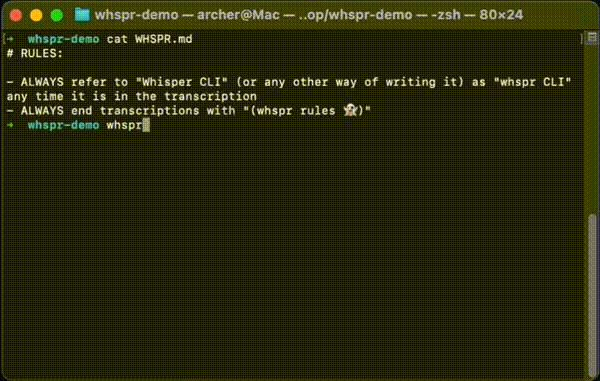

# whspr

[](https://www.npmjs.com/package/whspr)
[](https://choosealicense.com/licenses/mit/)
[](./CONTRIBUTING.md)

A CLI tool that records audio from your microphone, transcribes it (Groq Whisper or OpenAI `gpt-4o-transcribe`), and post-processes the transcription with AI to fix errors and apply custom vocabulary. Post-processing supports Groq, Anthropic, and **any OpenRouter model**.

<p align="center">
  
</p>

## Installation

```bash
npm install -g whspr
```

### Optional: Alias as `whisper`

If you'd like to use `whisper` instead of `whspr`, add this to your shell config (`~/.zshrc` or `~/.bashrc`):

```bash
alias whisper="whspr"
```

## Requirements

- Node.js 18+
- FFmpeg (`brew install ffmpeg` on macOS)
- Groq API key (default transcription provider + free Groq post-processing models)
- OpenAI API key (optional, for `gpt-4o-transcribe` / `gpt-4o-mini-transcribe` / `whisper-1` transcription)
- Anthropic API key (optional, for Anthropic post-processing models)
- OpenRouter API key (optional, unlocks any model on [OpenRouter](https://openrouter.ai/models))

## Usage

```bash
# Set your API keys (only the ones you plan to use)
export GROQ_API_KEY="your-api-key"
export OPENAI_API_KEY="your-api-key"        # Optional, for OpenAI transcription
export ANTHROPIC_API_KEY="your-api-key"     # Optional, for Anthropic post-processing
export OPENROUTER_API_KEY="your-api-key"    # Optional, for OpenRouter post-processing

# Run the tool
whspr

# With verbose output
whspr --verbose

# Pipe output to another command (instead of clipboard)
whspr --pipe "pbcopy"              # Explicit clipboard
whspr --pipe "claude"              # Pipe directly to Claude Code
whspr -p "cat >> notes.txt"        # Append to a file

# Re-transcribe a saved recording
whspr --from-recording
```

Press **Enter** to stop recording.

## Features

- Live audio waveform visualization in the terminal
- 15-minute max recording time
- Transcription via **Groq Whisper** (default) or **OpenAI** (`gpt-4o-transcribe`, `gpt-4o-mini-transcribe`, `whisper-1`)
- AI-powered post-processing via **Groq**, **Anthropic**, or **OpenRouter** (any OpenRouter-hosted model)
- Progress bar during post-processing
- Cost tracking — static pricing for Groq/Anthropic, real billed cost reported by OpenRouter
- Custom vocabulary support via `WHSPR.md` (global and local)
- Configurable settings via `~/.whspr/settings.json`
- Automatic clipboard copy (or pipe to any command with `--pipe`)
- Optional auto-save for transcriptions and audio files
- Re-transcribe saved recordings with `--from-recording`

## Settings

Create `~/.whspr/settings.json` to customize whspr's behavior:

```json
{
  "verbose": false,
  "suffix": "\n\n(Transcribed via Whisper)",
  "transcriptionProvider": "groq",
  "transcriptionModel": "whisper-large-v3-turbo",
  "language": "en",
  "model": "groq:openai/gpt-oss-120b",
  "systemPrompt": "Your task is to clean up transcribed text...",
  "customPromptPrefix": "Here's my custom user prompt:",
  "transcriptionPrefix": "Here's my raw transcription output:",
  "alwaysSaveTranscriptions": false,
  "alwaysSaveAudio": false,
  "saveTranscriptionsToCwd": false
}
```

| Option                     | Type    | Default                                                         | Description                                                                    |
| -------------------------- | ------- | --------------------------------------------------------------- | ------------------------------------------------------------------------------ |
| `verbose`                  | boolean | `false`                                                         | Enable verbose output                                                          |
| `suffix`                   | string  | none                                                            | Text appended to all transcriptions                                            |
| `transcriptionProvider`    | string  | `"groq"`                                                        | Transcription provider: `"groq"` or `"openai"`                                 |
| `transcriptionModel`       | string  | provider default                                                | Groq: `"whisper-large-v3"`, `"whisper-large-v3-turbo"`. OpenAI: `"gpt-4o-transcribe"`, `"gpt-4o-mini-transcribe"`, `"whisper-1"` |
| `language`                 | string  | `"en"`                                                          | ISO 639-1 language code (e.g., `"en"`, `"zh"`, `"es"`). Ignored by OpenAI `gpt-4o-*` models |
| `model`                    | string  | `"groq:openai/gpt-oss-120b"`                                    | Post-processing model in `provider:model-name` format (see below)              |
| `systemPrompt`             | string  | (built-in)                                                      | System prompt for AI post-processing                                           |
| `customPromptPrefix`       | string  | `"Here's my custom user prompt:"`                               | Prefix before custom prompt content                                            |
| `transcriptionPrefix`      | string  | `"Here's my raw transcription output that I need you to edit:"` | Prefix before raw transcription                                                |
| `alwaysSaveTranscriptions` | boolean | `false`                                                         | Always save transcription text files to `~/.whspr/transcriptions/`             |
| `alwaysSaveAudio`          | boolean | `false`                                                         | Always save audio MP3 files to `~/.whspr/recordings/`                          |
| `saveTranscriptionsToCwd`  | boolean | `false`                                                         | Save transcriptions to current directory instead of `~/.whspr/transcriptions/` |

### Supported Providers

The `model` setting uses a `provider:model-name` format. Supported providers:

| Provider     | API Key Required      | Notes                                                               |
| ------------ | --------------------- | ------------------------------------------------------------------- |
| `groq`       | `GROQ_API_KEY`        | Free tier available                                                 |
| `anthropic`  | `ANTHROPIC_API_KEY`   | Claude models                                                       |
| `openrouter` | `OPENROUTER_API_KEY`  | Any model on [OpenRouter](https://openrouter.ai/models); real-time cost reported by the API |

### Common Models

| Provider     | Model                              | Description                              |
| ------------ | ---------------------------------- | ---------------------------------------- |
| `anthropic`  | `claude-sonnet-4-5`                | Balanced speed and quality (recommended) |
| `anthropic`  | `claude-haiku-4-5`                 | Fastest responses, smaller model         |
| `anthropic`  | `claude-opus-4-5`                  | Best quality, slower and more expensive  |
| `groq`       | `openai/gpt-oss-120b`              | Default model                            |
| `groq`       | `llama-3.3-70b-versatile`          | Fast, versatile Llama model              |
| `groq`       | `moonshotai/kimi-k2-instruct-0905` | Moonshot Kimi model                      |
| `openrouter` | `google/gemini-2.0-flash-001`      | Cheap, fast Gemini via OpenRouter        |
| `openrouter` | `anthropic/claude-sonnet-4.5`      | Claude via OpenRouter (one key, many providers) |
| `openrouter` | `xiaomi/mimo-v2.5`                 | Any OpenRouter-hosted model works        |

> **Note:** Model names are set by the providers and may change at any time. Check [Groq Models](https://console.groq.com/docs/models), [Anthropic Models](https://docs.anthropic.com/en/docs/about-claude/models), and [OpenRouter Models](https://openrouter.ai/models) for the latest available models.

### Transcription Providers

The `transcriptionProvider` + `transcriptionModel` settings control which speech-to-text model is used.

| Provider | Model                    | API Key          | Notes                                                        |
| -------- | ------------------------ | ---------------- | ------------------------------------------------------------ |
| `groq`   | `whisper-large-v3-turbo` | `GROQ_API_KEY`   | Default — fast and cheap                                     |
| `groq`   | `whisper-large-v3`       | `GROQ_API_KEY`   | Higher accuracy, slower                                      |
| `openai` | `gpt-4o-transcribe`      | `OPENAI_API_KEY` | OpenAI's highest-quality transcription model                 |
| `openai` | `gpt-4o-mini-transcribe` | `OPENAI_API_KEY` | Smaller/cheaper GPT-4o transcription                         |
| `openai` | `whisper-1`              | `OPENAI_API_KEY` | OpenAI's hosted Whisper. Only model that accepts `language`. |

### Example: Using Claude with Custom Suffix

```json
{
  "model": "anthropic:claude-sonnet-4-5",
  "suffix": "\n\n(Transcribed via Whisper, edited via Claude Sonnet 4.5)"
}
```

### Example: GPT-4o Transcription + OpenRouter Post-processing

```json
{
  "transcriptionProvider": "openai",
  "transcriptionModel": "gpt-4o-transcribe",
  "model": "openrouter:google/gemini-2.0-flash-001"
}
```

### Example: Auto-save Transcriptions to Current Directory

```json
{
  "alwaysSaveTranscriptions": true,
  "saveTranscriptionsToCwd": true
}
```

## Pipe Output

Use `--pipe` (or `-p`) to send the transcription to any command instead of the clipboard:

```bash
# Pipe to Claude Code for further processing
whspr --pipe "claude"

# Append to a file
whspr --pipe "cat >> meeting-notes.txt"

# Send via curl
whspr --pipe "xargs -I {} curl -X POST -d 'text={}' https://api.example.com"
```

If the pipe command fails, whspr falls back to copying to the clipboard.

## Custom Vocabulary

Create a `WHSPR.md` (or `WHISPER.md`) file to provide custom vocabulary, names, or instructions for the AI post-processor.

### Global Prompts

Place in `~/.whspr/WHSPR.md` for vocabulary that applies everywhere:

```markdown
# Global Vocabulary

- My name is "Alex" not "Alec"
- Common terms: API, CLI, JSON, OAuth
```

### Local Prompts

Place in your current directory (`./WHSPR.md`) for project-specific vocabulary:

```markdown
# Project Vocabulary

- PostgreSQL (not "post crest QL")
- Kubernetes (not "cooper netties")
- My colleague's name is "Priya" not "Maria"
```

When both exist, they are combined (global first, then local).

## How It Works

1. Records audio from your default microphone using FFmpeg
2. Displays a live waveform visualization based on audio levels
3. Converts the recording to MP3
4. Sends audio to the configured transcription provider (Groq Whisper or OpenAI)
5. Loads custom prompts from `~/.whspr/WHSPR.md` and/or `./WHSPR.md`
6. Sends transcription + custom vocabulary to the configured post-processing model (Groq / Anthropic / OpenRouter) with a progress bar
7. Applies suffix (if configured)
8. Displays result with word count, character count, and cost estimate
9. Pipes to command (`--pipe`) or copies to clipboard
10. Saves transcription/audio files (if configured)

If transcription fails, the recording is saved to `~/.whspr/recordings/`. Use `whspr --from-recording` to select and re-transcribe any saved recording.

## License

MIT
